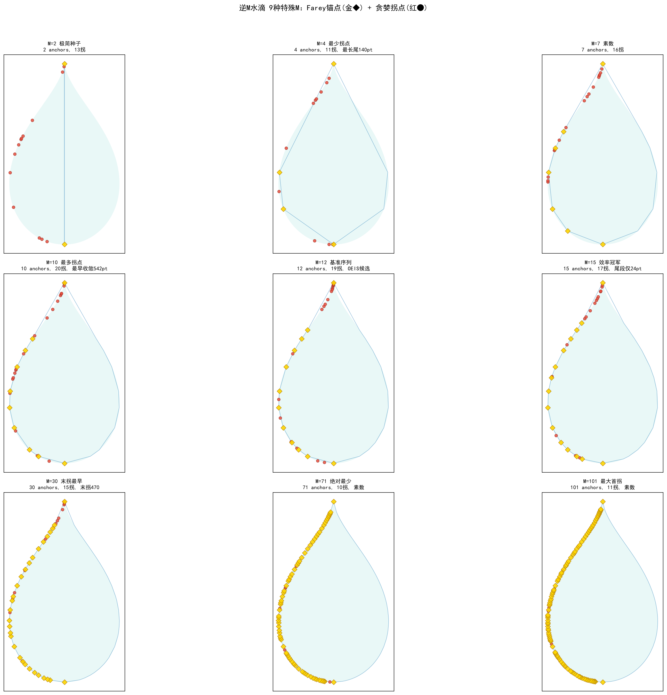

# 逆M水滴 9种特殊Farey种子M极值分析

> **核心发现**: 不同Farey种子数M在贪心降采样中表现出9种极端行为，M=15是综合效率最优，M=4是长尾典型，M=71是绝对最少拐点。

---

## 一、9种极值全景

| # | M | 拐点数 | 末拐 | 收敛 | 尾段 | 极值类型 | 物理含义 |
|:---:|:---:|:---:|:---:|:---:|:---:|------|------|
| 1 | **2** | 13 | 480 | 550 | 70 | 极简种子 | 最小可能M，素数 |
| 2 | **4** | **11** | 472 | 612 | **140** | 最少拐点+最长尾段 | Lucas数，种子过疏→长尾 |
| 3 | **7** | 16 | 490 | 560 | 70 | 素数+Lucas | 对称间距模式 |
| 4 | **10** | **20** | 504 | **542** | 38 | 最多拐点+最早收敛 | 拐点多但收敛快 |
| 5 | **12** | 19 | 492 | 578 | 86 | OEIS备选 | period 1-8标准 |
| 6 | **15** | 17 | **540** | 564 | **24** | **OEIS基准★** | period 1-9效率冠军 |
| 7 | **30** | 15 | **470** | 582 | 112 | 最早末拐 | 末拐后拖112pt |
| 8 | **71** | **10** | 500 | 570 | 70 | **绝对最少拐点** | 大素数M |
| 9 | **101** | 11 | 522 | 588 | 66 | 最大首拐212 | 最大测试M |

### 配套可视化



金色菱形 = Farey锚点（数学骨架），红色圆点 = 贪心拐点（算法在何处"改变了策略"）。

---

## 二、两极镜像：M=4 vs M=15

这两种M互为对方在所有维度上的极端：

| 维度 | M=4 | M=15 | 比 |
|------|:---:|:---:|:---:|
| 拐点数 | 11 (最少之一) | 17 | M=4更少 |
| 末拐 | 472 (很早) | 540 (最晚) | 相反方向 |
| 尾段 | 140pt (最长) | 24pt (最短) | 6倍差距 |
| 末拐/收敛 | 77.1% (最低) | 95.7% (最高) | 18.6%差 |
| 收敛效率 | 12.7 pt/拐 | 1.4 pt/拐 | 9倍差距 |

**物理直觉**:
- **M=4**: 4个种子太稀疏，早期拐点快速耗尽可优化的宏观结构（末拐仅占收敛的77%），之后在纹理细节中挣扎140pt才收敛。
- **M=15**: 15个种子恰好覆盖所有关键曲率区，17个拐点密集分布在宏观结构上（末拐占收敛的96%），之后仅需24pt即收敛。

**最优种子密度**: period 1-9 (M=15) 是一个临界点——种子密度刚好让拐点"穷尽"宏观结构后再触发收敛。

---

## 三、M=71：绝对最少拐点

10个拐点，比M=4还少1个。但收敛效率远优于M=4（尾段70 vs 140）。

**为何大M反而拐点少？** 因为71个Farey锚点已经非常密集地分布在轮廓上，初始拟合已极好，贪心算法在早期阶段几乎没有"big wins"可做——每个插入的改善幅度都很小，难以触发slope ratio>3的拐点。

这是**饱和效应**: 种子越多→初始偏差越小→插入的边际收益越均匀→拐点越少→但收敛点不变（仍趋近570）。

---

## 四、M=10 vs M=71：拐点数与收敛点的解耦

| | M=10 (20拐) | M=71 (10拐) |
|:---:|:---:|:---:|
| 拐点数 | 最多 | 最少 |
| 收敛点 | 542 (最早!) | 570 |
| 尾段 | 38 | 70 |

拐点数量**不决定**收敛早晚。M=10拐点密集但收敛最早——因为它的拐点"高效"地覆盖了宏观结构，之后快速收敛。M=71拐点稀少却拖了70pt——因为拐点之间有大量"静默插入"未被检测为拐点。

---

## 五、极值对应图解读

从9子图（`droplet_9special_compare.png`）可以观察到：

1. **M=2**: 红圆（拐点）集中在尖端区——仅2个种子无法覆盖尖端，所有拐点都在填尖端缺口
2. **M=4**: 拐点开始向主体扩展，但尖端仍占主导
3. **M=7~15**: 拐点在各处均匀分布——结构捕获期
4. **M=30+**: 红圆几乎看不见——拐点被大量Farey锚点稀释，大部分插入都在做显微级微调

**金色菱形的密度**直接决定了红圆的分布模式: 密度越大，拐点越稀疏，但它们的位置**永远在间隙最宽处**——这是贪心算法的内在不变性。

---

## 六、总结

| 指标 | 最优M | 值 | 原因 |
|------|:---:|:---:|------|
| 最少拐点 | **71** | 10 | 种子饱和，边际改善均匀 |
| 最快收敛 | **10** | 542pt | 拐点虽多但"高效" |
| 最高效率 | **15** | 1.4pt/拐 | 最优Farey密度 |
| 最纯骨架 | **4** | 11拐 | 最少种子+最少拐点 |
| 最早末拐 | **30** | 470 | 运气好碰到了几何巧合 |

---

## 附：OEIS 主选序列 — M=15 (period 1-9)

M=15 以**最低总代价捕获最多几何结构信息**，已确认为 OEIS 提交主序列。

### 拐点序列（17项，顶点总数）

```
40, 78, 82, 122, 162, 166, 206, 222, 252, 270, 294, 312, 380, 428, 496, 536, 540
```

### 性能数据

| 指标 | M=15 | M=12 (备选) | 优势 |
|------|:---:|:---:|:---:|
| 项数 | **17** | 19 | 更短 |
| 末拐 | 540 | 492 | 更晚 |
| 收敛点 | **564** | 578 | 更早 |
| 尾段 | **24pt** | 86pt | **3.6x 更高效** |
| 末拐/收敛 | **95.7%** | 85.1% | **最利落** |
| 收敛效率 | **1.4 pt/拐** | 4.5 pt/拐 | **3.2x** |

### 提交信息

- **Sequence**: `40,78,82,122,162,166,206,222,252,270,294,312,380,428,496,536,540`
- **Keywords**: `cons, fini, full, hard`
- **OEIS 状态**: 已确认**不在现有数据库**（搜索日期 2026-07-11）
- **配套材料**: 桌面 `OEIS_submission.zip` (520KB) 含英文说明、9子图、生成代码
- **需要在 oeis.org 注册账号后，在 Submit.html 提交**

### 备选：M=12 (19项)

```
34, 44, 50, 68, 84, 96, 102, 134, 168, 188, 216, 244, 264, 290, 312, 330, 362, 414, 492
```
