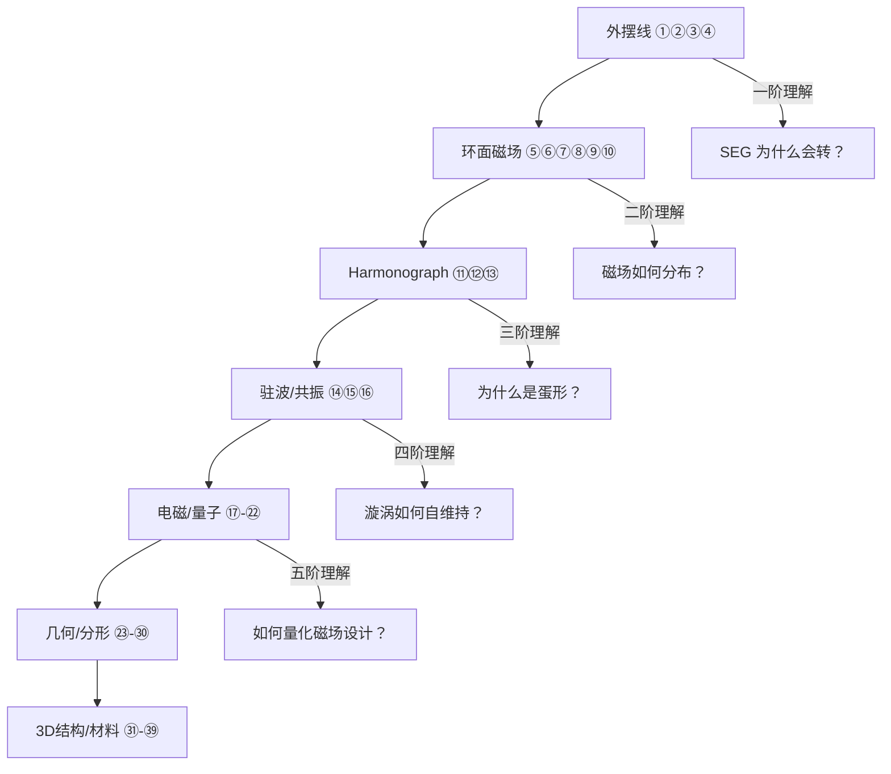

# NB演示程序教学指南 — 60 个 Mathematica 演示如何支撑本项目的物理理解

> **来源**: `瑟尔讲解所需nb\` 目录下 60 个 .nb 文件
> **工具**: Wolfram Mathematica (`.nb` 格式)
> **目标**: 逐一说明每个演示文件对应的物理原理，以及它如何帮助理解 Searl SEG / Schauberger 飞碟 / PKS 蛋形漩涡

---

## 一、为什么用 NB 演示？

本项目涉及的物理是**高度视觉化的多体几何问题**：
- 外摆线滚柱轨迹（Searl SEG 的核心运动学）
- 环面磁场分布（SEG 磁化图案设计）
- 蛋形截面漩涡（Schauberger 内爆/向心漩涡）
- 谐波叠加（Harmonograph → 蛋形 Laplace 谱）

Mathematica `.nb` 演示的独特优势：
1. **实时参数调节**：拖动滑块即可看到几何形状如何变化
2. **3D 旋转观察**：从任意角度观察复杂的空间轨迹
3. **动画回放**：看到轨迹随时间演化的完整过程

---

## 二、按学习路径分类

### 路径 A：从外摆线到 SEG（初学者推荐）

> 建议学习顺序：① → ② → ③ → ④

| # | 文件名 | 演示什么 | 对应 SEG 原理 |
|:---:|:---|:---|:---|
| ① | `瑟尔滚筒环绕定子轨迹模拟Epitrochoids.nb` | 一个滚柱绕定子的外摆线轨迹 | SEG 最基本的运动单元 |
| ② | `searl单滚筒轨迹.nb` | 单滚柱在环上的完整运动 | 理解 "公转+自转" 的复合运动 |
| ③ | `searl 4滚筒模拟MultipleFerrisWheels.nb` | 4 个滚柱同时运动，彼此干涉 | 多滚柱的相位耦合 |
| ④ | `多定子环内频率变化轨迹模拟.nb` | 改变转速观察轨迹变化 | 转速对轨道稳定性的影响 |

**看完这 4 个，你就理解 SEG 为什么会转。**

---

### 路径 B：环面/磁环物理（进阶）

| # | 文件名 | 演示什么 | 对应 PKS 科技 |
|:---:|:---|:---|:---|
| ⑤ | `圆环太阳花磁场SpecialRoseSurfaces.nb` | 环面上的磁力线分布（像向日葵图案） | SEG 磁极 N/S 交替图案的设计来源 |
| ⑥ | `圆环周围以太引力向量演示.nb` | 环面周围的引力场矢量图 | ANU 力流 — 环面如何产生定向力场 |
| ⑦ | `rodin线圈模拟LieSubgroupsOfThe2DTorusGroup.nb` | Rodin 线圈在环面上的拓扑布线 | `14_anu结构/` 螺旋天线的数学基础 |
| ⑧ | `圆环表面绕行模拟.nb` | 粒子在环面上的螺旋运动 | 滚柱在环面上的真实 3D 路径 |
| ⑨ | `圆环表面图形设计定位线圈.nb` | 在环面上精确放置线圈图案 | SEG 磁化图案的 CAD 设计 |
| ⑩ | `（重点）圆环灯罩参数可变.nb` | **可调参数**的环面（内径/外径/高度/厚度） | SEG 三环壳体的几何设计 |

**⑩ 是最重要的一个 — 它和 AAA 自研参数生成器直接对应！**

---

### 路径 C：Harmonograph → 蛋形谱（数学核心）

| # | 文件名 | 演示什么 | 对应 PKS 科技 |
|:---:|:---|:---|:---|
| ⑪ | `harmonograph searl原版.nb` | 经典双摆谐波图 | 蛋形 Laplace 谱的几何来源 |
| ⑫ | `harmonogragh simple 相位12分.nb` | 12 相位分割的谐波图 | $\lambda_n$ 标度律 — 12 分割 = 时钟面 + 音乐八度 |
| ⑬ | `harmonogragh simple 相位16分.nb` | 16 相位分割 | 更精细的频谱分辨率 |

**Harmonograph 原理**：两个正交方向的简谐振动叠加 → 李萨如图。当频率比为无理数时永不闭合 → 对应连续谱；频率比为有理数时闭合 → 对应离散谱。这与 PKS 蛋形 Laplace 谱的离散特征值 $\lambda_n$ 直接对应。

---

### 路径 D：驻波/共振 → Schauberger 漩涡（流体+波）

| # | 文件名 | 演示什么 | 对应 Schauberger 科技 |
|:---:|:---|:---|:---|
| ⑭ | `水面驻波公式.nb` | 水面驻波图案（Chladni 图案的水面版本） | 双曲锥体中的水漩涡驻波 |
| ⑮ | `球内驻波模拟动态实时图BanchoffsKleinBottle.nb` | 球腔内的驻波实时演化 | 蛋形腔共振 — 封闭空间的驻波模式 |
| ⑯ | `球内谐波图DampedSphericalPendulum.nb` | 球面阻尼谐波 | 涡旋管道的能量耗散模拟 |

**Schauberger 核心**：水在蛋形截面管道中形成驻波 → 波腹（低压区）吸入更多水 → 自维持循环。⑭⑮⑯ 让你看到 "形状决定波模，波模决定流动" 的物理本质。

---

### 路径 E：电磁/量子 → SEG 磁场设计

| # | 文件名 | 演示什么 | 对应 SEG 科技 |
|:---:|:---|:---|:---|
| ⑰ | `偶极子辐射模式DipoleAntennaRadiationPattern.nb` | 天线辐射的 3D 方向图 | SEG 作为旋转偶极子阵列的电磁辐射模式 |
| ⑱ | `电磁3维李萨如图Damped3DLissajous.nb` | 三维空间中的电磁 Lissajous 轨迹 | SEG 的 3D 磁场轨迹 |
| ⑲ | `氢原子轨道HydrogenOrbitals.nb` | 量子力学氢原子轨道 | 蛋形域本征函数 — 球面谐波是蛋形谐波的特例 |
| ⑳ | `电子云SphericalHarmonics.nb` | 球谐函数的电子云可视化 | 蛋形域电子密度分布 |
| ㉑ | `3d电子云模拟3DMultipoleShapes.nb` | 多极矩的 3D 形状 | SEG 多层环的多极磁场展开 |
| ㉒ | `量子跳跃五行QuantumOctahedralFractalViaRandomSpinStateJumps.nb` | 量子态随机跳跃分形 | 离散能级谱 — SEG 的量子化能级 |

---

### 路径 F：几何/分形/幻方 → 宇宙数学

| # | 文件名 | 演示什么 | 对应 PKS / 宇宙学 |
|:---:|:---|:---|:---|
| ㉓ | `极坐标玫瑰曲线PolarPlotsForRoseCurvesAndLimacons.nb` | 极坐标中的花瓣曲线 | 蛋形截面 = $\rho(\theta) = R(1 + k\cos\theta)$ 的一种 |
| ㉔ | `圆内多分割反射线FrequencyChordProjection.nb` | 弦的频率分割 — 反射图案 | 蛋形内的射影几何 |
| ㉕ | `双圆场反射CircleReflections.nb` | 圆反射 — 无限迭代 | 均轮-本轮几何的多重嵌套 |
| ㉖ | `双镜面之间球反射MultipleReflectionsOfASuperball.nb` | 球在双镜面之间的无限反射 | SEG 滚柱在内外环之间的碰撞反射 |
| ㉗ | `（超美）多边形可变反射迭代图形IterativelyReflectedNGons.nb` | 正多边形的递归反射 → 分形 | PKS 自相似标度律 $\lambda_n = 2\pi\ln n$ |
| ㉘ | `分形环套环RecursiveExercisesVITori.nb` | 嵌套环面的自相似分形 | SEG 多层环的标度自相似性 |
| ㉙ | `4阶幻方880种模式MagicSquaresAndDesigns-author.nb` | 所有可能 4 阶幻方的枚举 | 跳房子数学 — 方块法则 |
| ㉚ | `完美幻方PandiagonalMagicSquaresOfOrderFive.nb` | 五阶泛对角幻方 | 方块法则 + 泛对角对称 |

---

### 路径 G：3D 几何 / 材料 / 卫星轨道

| # | 文件名 | 演示什么 | 实用价值 |
|:---:|:---|:---|:---|
| ㉛ | `3D几何体拼凑ConstructionSet-author.nb` | 用基本体素搭建复杂 3D 结构 | SEG 壳体 CAD |
| ㉜ | `圆锥体表面线段BoundaryValueProblemsForConeGeodesics-author.nb` | 圆锥曲面的测地线 | PKS 蛋形 = 斜切圆锥 → 测地线 = 流线 |
| ㉝ | `圆柱内向外立体投影CylindricalAnamorphosisOfParametricSurfaces-author.nb` | 圆柱面到平面的变形投影 | 环面展开 → 平面磁化图案 |
| ㉞ | `苹果圆环PositionDependentOpacity.nb` | 类似苹果形状的变形环面 | 蛋形环面 — SEG 壳体的非对称扩展 |
| ㉟ | `环内球体接触面压强研究HertzianContactStress-author.nb` | Hertz 接触应力 — 球压在平面上 | 滚柱与环面的接触力学 |
| ㊱ | `各种元素物质密度Density-author.nb` | 元素周期表密度数据 | SEG 材料选择 — 六元素合金 |
| ㊲ | `卫星绕月运动轨迹.nb` | 卫星在三体引力场中的复杂轨道 | SEG 滚柱在三环之间的轨道模拟 |
| ㊳ | `卫星绕地运动.nb` | 地球卫星轨道 | 类比滚柱绕中心环的公转 |
| ㊴ | `卫星与行星引力轨迹EffectsOfAForceOnTheOrbitOfAnArtificialSatellite-author.nb` | 外力扰动下的轨道演化 | 磁场力对滚柱轨道的扰动 |

---

### 路径 H：其他物理演示

| # | 文件名 | 演示什么 | 关联 |
|:---:|:---|:---|:---|
| ㊵ | `飞碟升降飞行轨迹PhaseSpaceTrajectoriesOfA1DAnharmonicOscillator-author.nb` | 非简谐振子的相空间轨迹 | IGV 飞碟的升力-重力振荡 |
| ㊶ | `球罩表面环运动轨迹SphericalCycloid-author.nb` | 球面上的摆线轨迹 | IGV 球壳上的滚柱运动 |
| ㊷ | `多个球并排的单摆运动PendulumWaves-author.nb` | 耦合单摆波 | SEG 多层滚柱的耦合振动 |
| ㊸ | `多普勒效应DopplerEffect-author.nb` | 波源运动对频率的影响 | SEG 旋转产生的电磁波频移 |
| ㊹ | `2D凹凸表面环绕以太梯度线CosineOffsetCurves-author.nb` | 曲面上的"以太梯度"等值线 | Schauberger 以太密度梯度 |
| ㊺ | `李萨如图LissajousArray-author.nb` | 双频叠加的李萨如图阵列 | 频率比 → 封闭 vs 开放轨道 |
| ㊻ | `圆环表面向量变化图CellularAutomatonLikeNeuralNetworkInAToroidalVectorField-author.nb` | 环面向量场上的元胞自动机 | 神经网络 vs 向量场 — SEG 自适应控制 |
| ㊼ | `环包环结构.nb` | 前一个环穿过下一个环的 3D 结构 | SEG 三层嵌套的几何实现 |
| ㊽ | `玫瑰花ARoseForValentinesDay-author.nb` | 数学玫瑰花曲线 | 极坐标蛋形的花朵类比 |
| ㊾ | `七彩圆环SevenColoringOfATorus-author.nb` | 环面七色定理 | 拓扑学在环面几何中的应用 |
| ㊿ | `正方体分化结构3DTotalisticCellularAutomata-author.nb` | 3D 总论元胞自动机 | 空间离散化 → SEG 离散磁极 |
| 51 | `勾股树.nb` | 毕达哥拉斯分形树 | 自相似 → λ_n 标度律 |
| 52 | `李萨如图LissajousArray-author.nb` | (同上) | |
| 53 | `fm 音乐合成器BasicFMSynthesisOfSounds-author.nb` | 频率调制音乐合成 | SEG 的频率调制原理 → 音乐 = 物理 |

---

## 三、学习路线图

---

## 四、与 AAA 自研程序的衔接

| AAA 程序 | 推荐先看的 NB 演示 |
|:---|:---|
| `index.nb` (交互演示) | ①+②+③+④ 理解外摆线 → ⑤+⑥ 理解磁场 → ⑩ 理解参数控制 |
| `AAA searl机方案生成.nb` (标准版) | ⑩ 环面参数 + ㉟ Hertz 接触 + ① 外摆线验证 |
| `AAA searl机方案生成大质量igv.nb` | ⑰ 偶极子辐射 + ⑱ 3D电磁 + ㊹ 以太梯度 |

---

> **关联阅读**:
> - [00_NB程序全功能分类与物理内涵.md](./00_NB程序全功能分类与物理内涵.md) — AAA 自研 4 算法参数对比
> - [01_AAA自研SEG参数生成器_深度解读.md](./01_AAA自研SEG参数生成器_深度解读.md) — 36 参数 + 6 约束
> - [02_SEG_vs_Schauberger飞碟_全面对比.md](./02_SEG_vs_Schauberger飞碟_全面对比.md) — 电磁 vs 流体
