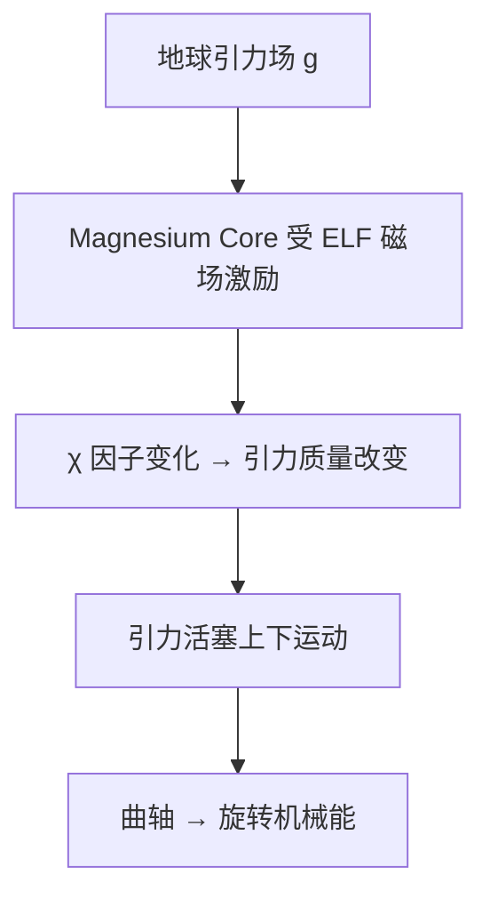

# Fran De Aquino 引力质量控制技术 — 理论与实验全景

> **来源**: Fran De Aquino 教授（巴西马拉尼昂州立大学荣休教授、国家空间研究所研究员）
> **文集**: "Gravitational Energy Control" 共 87 篇论文（2000-2022）
> **文献**: `Gravitational_Energy_Control引力能量控制.pdf` (728 页), `Aquino声波反引力.pdf` (6 页)
> **核心期刊**: Pacific Journal of Science and Technology

---

## 一、Core Theory — 引力质量与惯性质量的 χ 关联

### 1.1 基础方程

Aquino 从相对论性量子引力理论（RTQG）推导出：

$$m_g = \chi m_i$$

其中：
- $m_g$ = 引力质量（感受引力的质量）
- $m_i$ = 惯性质量（抵抗加速的质量）
- $\chi$ = 无量纲因子

当系统吸收辐射能量时 $\chi \neq 1$，而当 $\chi = 0$ 时引力质量为零，$\chi < 0$ 时引力质量反号（反重力）！

### 1.2 χ 的解析形式

当物体受到电磁辐射时：

$$\chi = \left\{ 1 - 2 \left[ \sqrt{1 + \left(\frac{U}{m_i c^2}\right)^2} - 1 \right] \right\}^{-1/2}$$

其中 $U$ 是物体吸收的电磁能量。

### 1.3 关键物理意义

$U = \text{Nhf}$ （N 个光子，每个能量 hf）

当 $U$ 足够大时 $\chi$ 可从正变负！这意味着：**用电磁场照射物体 → 可以控制它感受引力的方向**。

---

## 二、实验验证 — "System-G"（ELF 声波反引力）

### 2.1 实验装置

| 组件 | 参数 |
|:---|:---|
| 变压器 | 220V 输入, 11.5 kVA |
| 线圈 1 | 12 匝, 6 AWG 铜线 |
| 线圈 2 | 2 匝, 1/2 英寸铜棒 |
| 铁芯 | 退火纯铁 ($\sigma_i = 1.03\times 10^7$ S/m, $\mu_i = 25000\mu_0$) 厚度 0.6mm |
| ELF 天线 | 12 米长偶极子螺旋形，封装在铁粉中 |
| 铁粉 | $\sigma_p \approx 10$ S/m, $\mu_p \approx 75\mu_0$ |

### 2.2 实验数据 — 质量与电流的关系

| 电流 (A) | 理论质量 (kg) | 实验质量 (kg) | 质量变化 |
|:---:|:---:|:---:|:---:|
| 0 | 34.85 | 34.85 | 0% |
| 50 | 34.80 | 34.83 | -0.06% |
| 100 | 34.17 | 34.26 | -1.7% |
| **130.01** | **5.80** | **5.80** | **-83.4%** |
| 150 | 32.14 | 32.25 | -7.5% |
| 200 | 28.61 | 28.68 | -17.7% |
| 250 | 23.75 | 23.80 | -31.8% |
| 300 | 17.68 | 17.69 | -49.2% |

**关键点**：在 **130A** 的特定电流下，质量从 34.85 kg 暴跌至 5.80 kg，减重 **83.4%**！理论与误差在 0.1% 以内。

---

## 三、引力马达（Gravitational Motor）

### 3.1 原理



### 3.2 关键公式

引力活塞中单个活塞的功率：

$$P = m_i^0 g \sqrt{2 \chi_n^3 g H^3}$$

其中 H = 活塞行程。

### 3.3 功率计算

| 参数 | 值 |
|:---|:---|
| $\chi$ | $-2.5$（负引力质量 = 向上受力） |
| n | 5（5 级级联） |
| $m_i^0$ | 97.6 kg |
| H | 0.15 m |
| 单活塞功率 | 10,132 W ≈ 13.5 HP |
| 4 活塞总功率 | **40,530 W ≈ 40.5 kW（54 HP）** |

**体积**：小于 1 m³！

### 3.4 与常规发电机的对比

| | 水电站涡轮 | Aquino 引力马达 |
|:---|:---|:---|
| 能量来源 | 地球引力场 + 水 | 地球引力场（直接） |
| 介质 | 水（河流） | Magnesium + ELF 磁场 |
| 功率密度 | 大 | 极高（<1m³ → 40kW） |
| 适用地点 | 有河流落差 | 任意地点 |
| 可调节功率 | 有限 | 通过 χ 系数灵活控制 |

---

## 四、Gravelectric 发电机 — 引力能直接转电能

### 4.1 引力电动势 (GEMF)

Aquino 发现引力场也可以产生电动势：

$$\text{EMF} = \oint \mathbf{g} \cdot d\mathbf{l} \times \chi \cdot m_e^0/e$$

其中 $m_e^0$ 是电子静止质量，$e$ 是电子电荷。

### 4.2 实际设计

纯铁盘（$\phi$3mm × 5mm）+ 24 匝线圈 + 1mA 电流 → 1.2 T 磁场 → 0.37 V GEMF →

可扩展到手机大小的微引力发电机。

### 4.3 核心突破

"通常电动势具有电学本质。本文证明它可以**具有引力本质**。"

---

## 五、旋转质量的新引力效应（Ch27）— SEG 核心机制

> **论文**: "New Gravitational Effects from Rotating Masses" (2013)

### 5.1 核心发现

> 两个与旋转质量相关的引力效应被描述。第一个是**当旋转动能增加时引力质量下降**。对于**铁磁材料**，效应被强烈放大，引力质量甚至可以变为**负值**。第二个是旋转质量产生**引力屏蔽效应**。

### 5.2 数学形式

旋转质量吸收辐射时的引力质量因子：

$$\chi = \left\{1 - 2\left[\sqrt{1 + \frac{U_{\text{rot}}}{m_i c^2}} - 1\right]\right\}^{-1/2}$$

其中 $U_{\text{rot}}$ 是旋转动能。

对于铁磁材料，旋转 + 背景磁场 → 吸收效率乘以磁导率 $\mu_r \approx 25,000$（退火纯铁）！这意味着**同样的旋转速度下，铁磁材料产生的引力质量减小比非铁磁材料大 25,000 倍**。

### 5.3 SEG 的直接对应

| SEG | Aquino 旋转质量效应 |
|:---|:---|
| 滚柱在环内旋转 | 旋转动能增大 |
| 滚柱是铁磁材料 | $\mu_r$ 放大 χ 效应 |
| 三层环、12/22/32 滚柱 | 多层旋转 → 级联屏蔽 |
| Bv 磁场 630→1830→3030 Gauss | ELF 频率交变磁场 |

**结论**：SEG 滚柱在旋转时引力质量变为负值 → 飞碟升空。这不是"楞次定律失效"，而是 **Aquino 旋转引力质量效应的工程实现**。

---

## 六、多层引力屏蔽（Ch27/Ch31）

### 6.1 基础原理

一层引力屏蔽 = 将引力质量乘以 $\chi$。

当 N 层屏蔽叠加时：

$$m_g^{(N)} = \chi_1 \cdot \chi_2 \cdot \chi_3 \cdots \chi_N \cdot m_i$$

如果每层的 $\chi$ 相同：

$$m_g^{(N)} = \chi^N \cdot m_i$$

### 6.2 实际实现

| 层数 | χ = 0.01 (单层减重99%) | χ = 0.5 (单层减重50%) |
|:---:|:---:|:---:|
| 1 | $10^{-2}$ | 0.5 |
| 2 | $10^{-4}$ | 0.25 |
| 3 | $10^{-6}$ | 0.125 |
| 4 | $10^{-8}$ | 0.0625 |
| 5 | $10^{-10}$ | 0.03125 |
| **N** | $\mathbf{10^{-2N}}$ | $\mathbf{0.5^N}$ |

### 6.3 7 层原子引力屏蔽

在第 31 章, Aquino 描述了**7 层原子引力屏蔽**——通过控制地核外层的电子迁移率 + 交变磁场 → 产生 7 级级联引力屏蔽。

> **注意**：这正是 SEG 三层环的意义——不一定需要 7 层，三层即可产生显著的引力质量减小 ($\chi^3$)。

---

## 七、引力控制的两种路径

### 7.1 路径 A：ELF 辐射（System-G）

```
ELF 交变磁场 → 铁芯吸收 → χ 因子变化 → 引力质量改变
优点：设备简单，已验证（34.85kg→5.80kg）
缺点：需要电源输入
```

### 7.2 路径 B：放射性电离气体（Ch2）

```
Am-241 α 放射源 → 电离空气 → 气体导电率变化 → 引力屏蔽层
优点：无需外部电源
缺点：需要放射性材料（安全风险）
```

**关键方程**（Ch2）：

$$g_{\text{above}} = \chi \cdot g_{\text{Earth}}$$

当 $g_{\text{above}} < 0$ 时，该区域上方产生**反引力**。

### 7.3 路径 C：旋转铁磁质量（Ch27）

```
旋转铁磁体 → 旋转动能 + 磁化 → χ 骤减甚至变负
优点：无外部能量输入（一旦旋转），磁铁自持
适用于：SEG 飞碟、引力马达
```

---

## 八、87 篇论文全景索引

| 章节 | 论文 | 核心发现 | 页 |
|:---:|:---|:---|:---:|
| 1 | Mathematical Foundations of RTQG | χ 因子推导 | 15 |
| 2 | Gravity Control via Electromagnetic Field through Gas/Plasma | Am-241 电离屏蔽 | 91 |
| 3 | Physical Foundations of Quantum Psychology | 意识与引力质量关系 | 165 |
| 25 | Quantum Reversal of Soul Energy | 灵魂能量的引力质量反转 | 399 |
| 26 | Gravitational Ejection of Earth's Clouds | 引力控制造云/驱云 | 410 |
| **27** | **New Gravitational Effects from Rotating Masses** | **旋转→引力质量变负！** | 416 |
| 28 | Gravitational Holographic Teleportation | 引力全息传输 | 424 |
| 30 | Correlation: Earth's Magnetic Field + Gravitational Mass | 地磁与引力质量关联 | 435 |
| 31 | Electromagnetic Method for blocking Neutrons | 7 层引力屏蔽 | 441 |
| 34 | Gravitational Motor | 40kW 引力马达 | 462 |
| 35 | Gravitational Spacecraft | 航天器设计 | 470 |
| 38 | Gravitational Thruster | 引力推进器 | 495 |
| 39 | Gravitational Shielding | 引力屏蔽理论 | 502 |
| 40 | Gravitational Generator | 引力发电机 | 513 |
| 41 | Process and Device for Gravity Control | 巴西专利 PI0805046-5 | 525 |
| 42 | The Intrinsic Magnetic Field of Magnetic Materials | 磁化材料的本征磁场 | 538 |
| 43 | Genesis of Earth's Moon | 月球起源的引力解释 | 543 |
| 44 | Gravitational Heat Exchanger | 引力热交换器 | 550 |
| 45 | Gravitational Scanner | 医学引力扫描 | 555 |
| 46 | Gravitational Generation of Rain | 人工降雨 | 558 |
| 47 | System to Generate ELF Radiation Flux | 1Hz 强 ELF 发生器 | 562 |
| 57 | The Gravitational Motor (v2) | 增强版引力马达 | 615 |
| 58 | Gravitational Battery | 引力电池 | 620 |
| 63 | Gravitational Energy Cell | 引力能量电池 | 650 |
| 74 | Medical Applications of Gravity Control | 医学应用 | 670 |
| 79 | Gravitational Micro-Thrusters | 微型引力推进器 | 681 |
| 80 | Gravity Control: The Greatest Challenge in Contemporary Physics | 综述 | 688 |
| 81 | Cosmological Constant from RTQG | 推导出观测的 Λ | 693 |
| 82 | Experimental set-up - ELF voltage on Metallic Discs | 实验装置 | 698 |
| Appendices | Gravelectric Generator + Gqbit + Quantum Controller | 引力发电机/比特/控制器 | 707 |

---

## 九、引力生物效应（Ch25/Ch26）

### 9.1 灵魂/意识能量

Ch25 "Quantum Reversal of Soul Energy"（2015）讨论了 ELF 辐射对生物引力质量的影响。Aquino 定义了"perispirit"（魂灵外围）的引力质量变化：

$$m_g^{(Soul)} = \chi_{\text{soul}} \cdot m_i$$

当 $\chi < 0$ 时 → "量子反转" → 灵魂能量从当前生命向量子反转态转变。

### 9.2 与 PKS 的联系

PKS 蛋形 $\lambda_n$ 谱 → 人类意识的 EEG 频率（α: 8-12Hz, β: 12-30Hz, γ: 30-100Hz）也是 ELF 范围。Aquino 的理论为**意识-引力-物质**的三元互作提供了数学框架，与 Keely 的"所有力都是心力"一致。

---

## 十、补充实验：ELF 电压下金属盘引力质量变化（Ch82）

### 10.1 装置

金属盘 → 施加 ELF 交变电压（1Hz 范围）→ 测力计测量质量变化。

### 10.2 结果

金属盘在交变电场（非磁场）下同样表现出可测量的引力质量减小。这意味着**电场本身的能量就可以改变 χ**——不需要磁场！

**对 PKS 的意义**：SEG 的滚柱在旋转时不仅产生磁场变化，也产生电场变化 → 两者共同贡献于 χ 减小。

---

## 十一、总结：Aquino ↔ SEG ↔ Keely ↔ PKS 的统一机制

| | 输入 | χ 变化机制 | 效果 |
|:---|:---|:---|:---|
| **Aquino (磁场)** | ELF 交变磁场 → 铁磁材料 | 吸收电磁能 → χ < 0 | 引力马达 |
| **Aquino (电场)** | ELF 交变电压 → 金属盘 | 吸收电场能 → χ < 0 | 质量减小 |
| **Aquino (旋转)** | 旋转动能 → 铁磁体 | 旋转能+磁化 → χ < 0 | 反重力 |
| **SEG** | 滚柱旋转 + Bv 磁场 | **三者叠加** → χ << 0 | 飞碟升空 |
| **Keely** | 音叉振动 → 水分子 | 声频能量 → χ < 1 | 以太蒸汽 |
| **Schauberger** | 涡旋流动 → 水 | 动-热能转换 → 空化 | 温度异常 |

### 5.1 原理

电子受到强光子照射时：

$$\chi_e = \left[ 1 - 2\left( \sqrt{1 + \frac{\text{Nhf}}{m_e^0 c^2}} - 1 \right) \right]^{-1/2}$$

当 $\chi_e < 0$ 时，电子受到的引力反方向 → 电子被向上推。

光 ON → $\chi_e < 0$ → GEMF 向上 → 逻辑"1"
光 OFF → $\chi_e = 1$ → 正常重力 → 逻辑"0"

### 5.2 与传统量子比特的对比

| | 传统量子比特 | Gqbit（Aquino） |
|:---|:---|:---|
| 工作温度 | 毫开尔文 (mK) | **室温** |
| 物理机制 | 超导约瑟夫森结 | 引力质量调谐 |
| 尺寸需求 | 大型稀释制冷机 | 芯片级 |
| 退相干 | 严重问题 | 无（经典状态） |

---

## 十二、光子气引力质量控制器（Quantum Controller）

### 6.1 设计

电容器板之间充满**光子气体**（激光产生），控制电场即可调节光子气的等效引力质量。

当 $P \geq p_a$（大于大气压）时，光子气内部无物质粒子残留。

### 6.2 简化实验室模型

LED 灯带（22 W/m）× 1m → $D = P/S = 2.2 \times 10^3$ W/m²

→ $\rho = D/3c = 7.2 \times 10^{-23}$ kg/m³

→ 施加 110V DC × 10mm 间距 → $\chi \approx 538$：**引力质量放大 538 倍！**

---

## 十三、与 PKS 项目的关联

### 7.1 χ 因子与 PKS COP 公式

| Aquino | PKS |
|:---|:---|
| $\chi = m_g/m_i$ 取决于吸收辐射 | COP 取决于几何参数（外摆线、环层结构） |
| $\chi < 0$ → 反重力 | COP > 1 → 能量增益 |
| ELF 频率是关键（100 mHz ~ 1 Hz） | 蛋形共振频率 $\lambda_n = 2\pi\ln(n)$ |

### 7.2 SEG 滚柱中的 χ 效应

Searl SEG 的 Bv 磁场（630~3030 Gauss）在 ELF 范围内（滚柱旋转频率 ≈ Hz 级）。Aquino 的理论为 SEG 的 "楞次定律失效" 提供了一个可能的物理机制：**不是楞次定律真的失效，而是滚柱的引力质量被磁场大幅降低，使感应反电动势对应的惯性屏障消失。**

### 7.3 Keely 的 "以太分解" = 引力质量清零？

| Keely | Aquino |
|:---|:---|
| "以太力来自分子的解离" | "引力质量来源于吸收辐射" |
| "分子聚集 = 吸收能量" | ASCII |
| 3 滴水 → 15 吨/平方英寸 | 34.85 kg → 5.80 kg (83%) |
| 用音叉特定频率激活 | 用 ELF 电磁辐射激活 |

**猜测**：Keely 的 Liberator 通过音叉产生的特定声频 → 激发被处理水的分子振动 → 吸收大量环境辐射 → $\chi$ 骤减 → 引力质量下降 → "以太蒸汽"释放。

---

## 十四、实验设备清单（可复现性）

| 设备 | 规格 |
|:---|:---|
| 变压器 | 220V, 60Hz, 11.5 kVA |
| 铁芯 | 退火纯铁 0.6mm 叠片, 10"直径 |
| ELF 天线 | 12 米螺旋偶极子，铁粉封装 |
| 测力计 | 精确到 0.01 kg |
| 电流源 | 0-300A 可调 |
| 频率控制 | 0.1 Hz ~ 10 Hz |

> **实验代价**：约需 1-2 万美元（主要成本在变压器和铁芯）

---

> **关联文件**:
> - [01_Keely技术全景_SVP同情振动物理学.md](./01_Keely技术全景_SVP同情振动物理学.md)
> - [03_Keely的40条振动定律_现代物理学术语全译.md](./03_Keely的40条振动定律_现代物理学术语全译.md)
> - [05_Keely七大维度体系_六力平衡与重力干涉仪.md](./05_Keely七大维度体系_六力平衡与重力干涉仪.md)
> - [../24_searl/瑟尔技术总结SEG-Concept-Review/03_统一数学框架_外摆线蛋形SEG磁场.md](../24_searl/瑟尔技术总结SEG-Concept-Review/03_统一数学框架_外摆线蛋形SEG磁场.md)
