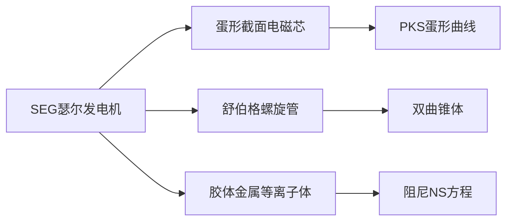

# SEG瑟尔技术 · 原理_总索引

> **SEG (Searl Effect Generator) 瑟尔效应发电机与 PKS 体系的关联**
> 
> 归档日期：2026-07-07

---

## 一、核心定位

SEG（瑟尔效应发电机）是 John Searl 提出的磁流体力学自由能装置，其核心元件的几何与 PKS 体系中的**双曲锥螺旋管 + 蛋形截面磁芯**精确对应。本索引关联 `24_searl_SEG` 目录中所有文件。

## 二、全文件索引

### A. 技术文档
> `02_应用科技/24_searl_SEG/`

| 文件 | 核心内容 |
|------|---------|
| `SEG_IGV_Jellium性价比工程指南.md` | 🏆 **最实用**：SEG 工程分级（安全/推荐/进取三档），Jellium胶体金属性价比分析，成本估算 |
| `SEG_IGV_技术总览.md` | SEG 与 IGV (Inertial Guidance Vector) 的总体技术框架 |
| `Neutrinic_Elixirs_科技提纯与PKS融合.md` | 中微子药剂的科技提纯路径与 PKS 融合方案 |

### B. 辅助目录
> `02_应用科技/24_searl_SEG/`

| 子目录 | 内容 |
|--------|------|
| `scripts_补充/` | 补充脚本 |
| `searlFx gif图/` | 动态效果图 |
| `searl图/` | 结构示意图片 |
| `瑟尔技术总结SEG-Concept-Review/` | SEG 概念回顾 |
| `瑟尔讲解所需nb/` | Mathematica Notebook 文件（含 `圆环表面轨迹运动分量SpiralsAndHelices-author.nb`）|
| `相关图片/` | 图片资料 |
| `编者个人领悟/` | 编者研究笔记 |

---

## 三、与 PKS 的关联

核心桥接：`SEG 的三档安全配置 (β→k→组装参数)` ↔ `PKS 的 β 阈值理论 + 阻尼 NS 方程`

> **建议**：`SEG_IGV_Jellium性价比工程指南.md` 提供了最直接的"从理论到工程"的转换路径，推荐作为 SEG 主题的首读文件。
